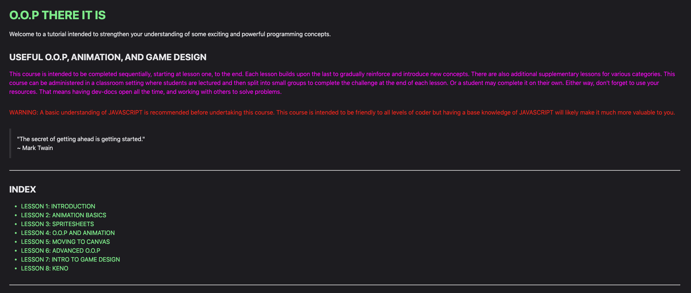

# O.O.P THERE IT IS #

### USEFUL O.O.P, ANIMATION, AND GAME DESIGN ###

## INDEX ##

* [DESCRIPTION](#description)
* [VISUALS](#visuals)
* [USAGE](#usage)
* [PROJECT STATUS](#project-status)
* [CREATORS](#creators)
* [TO DO LIST](#to-do-list)
* [BUGS](#bugs)
* [IDEAS](#ideas)
* [CREDITS](#credits)

## DESCRIPTION ##

This project is intended to be a useful learning tool that can be utilized as an individual or as a group, with or without an instructor. Object Oriented Programming, Animation, and Game Design are difficult concepts to grasp, yet they are fundamental concepts worth learning. It is the goal of this project to gradually introduce these concepts in way to maximize usefulness and retention.

---

## VISUALS ##

---

## USAGE ##

This resource can be provided as a whole, including the associated code examples, or it can be delivered lesson by lesson.

Both are valid approaches, though I prefer the lesson by lesson approach, at least for the associated challenge solutions.

That being said, there are global style and script dependencies that will need to be included with every lesson, depending on how you deploy.

The access point is the index.html file in the TUTORIAL directory.

---

## PROJECT STATUS ##

FINISHED FOR NOW

---

## CREATORS ##

Falken Brown - AUTHOR

Sierra Robinson - EDITOR

The Last Mile

March 2025

---

## TO DO LIST ##

- Formatting, Spellcheck, Proof Read

## BUGS ##

- Don't like 'em.
- barebones.js per-pixel collision detection does not function properly when scaling is applied to images. Need matrix.
- barebones.js per-pixel collision detection does not function properly when rotation is applied to multiple component spritesheets. Need matrix.
- Label class could not get the measureText method to work. Had to draw to the DOM and read. Bad performance.
- Pong glitches out when the ball hits the side of the paddle.

## IDEAS ##

- Lesson 2 sample code could be simplified to iterate over a string instead of an array.
- barebones.js per-pixel collision detection performance could be improved by performing matrix transformations to the collision mask instead of rendering to an offscreen canvas every time the mask changes.
- barebones.js per-pixel collision detection scaling problem could be improved by performing matrix transformations to the collision mask instead of rendering to an offscreen canvas.
- barebones.js could use a Matrix class.
- barebones.js might be better written in TypeScript.

## CREDITS ##

Most of the quotes: Sierra Robinson, she has great taste.

barebones.js AudioManager class notes getter frequency table: "https://developer.mozilla.org/en-US/docs/Web/API/Web_Audio_API/Simple_synth"

Phonetic Alphabet Image(lesson 1): "https://en.wikipedia.org/wiki/NATO_phonetic_alphabet"

Text animation ipsum text(lessons 1 and 2): "https://en.wikipedia.org/wiki/Internet_security"

Dev-docs Sprite(lesson 3): "https://devdocs.io/assets/sprites/docs@2x-b3faf7c3a1db9519c2aa8b789c8ba7bfa560b08a006ede054b59695cbe5df543.png"

Heart Shape(lesson 5) "https://devdocs.io/dom/canvas_api/tutorial/drawing_shapes"

Dev-docs Translation, Rotation, Curves, Slicing and Grid images(lesson 5) "https://devdocs.io/dom/canvas_api/tutorial"

Oroboros Image(lesson 5) "https://en.wikipedia.org/wiki/Recursion"

Trigonometry images(lesson 7) "https://en.wikipedia.org/wiki/Trigonometry"